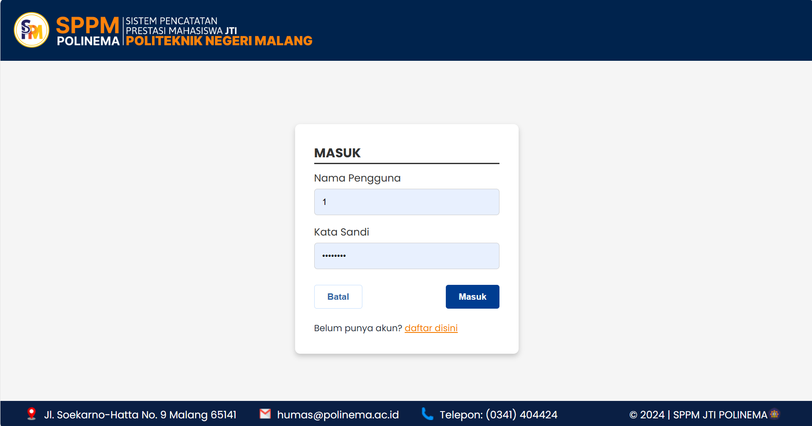
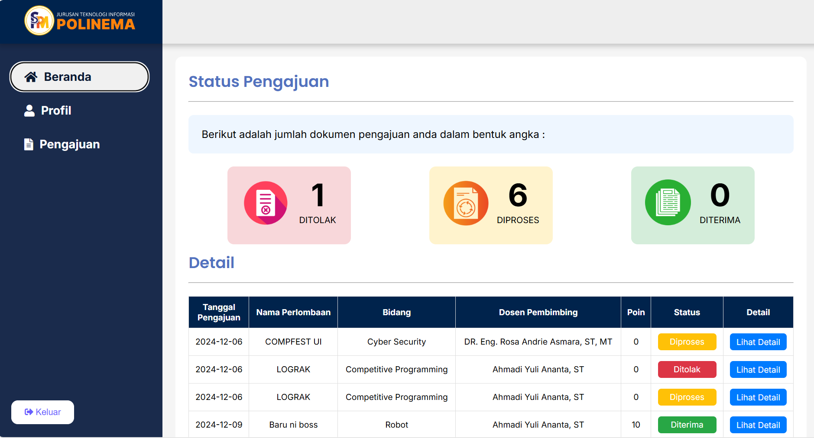
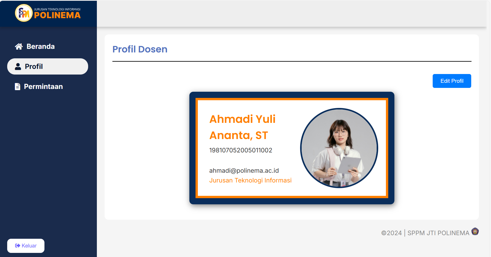
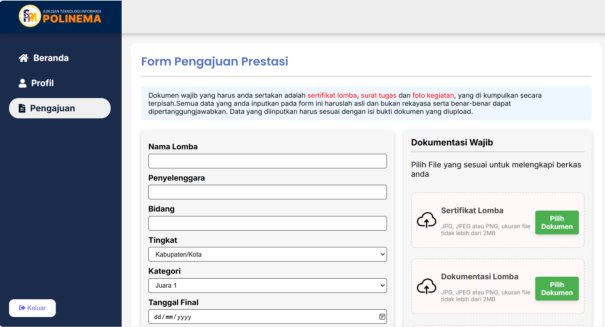

# SistemPrestasiJTIPolinema
# Sistem Pencatatan Prestasi Mahasiswa JTI Polinema

## Deskripsi
Sistem Pencatatan Prestasi Mahasiswa JTI Polinema adalah aplikasi berbasis web yang dirancang untuk memudahkan pengelolaan dan pencatatan prestasi mahasiswa di Jurusan Teknik Informatika, Politeknik Negeri Malang (Polinema). Dengan sistem ini, pengelolaan data prestasi dapat dilakukan dengan lebih efisien oleh dosen dan pihak administrasi.

## Fitur Utama
- **Pengelolaan Data Mahasiswa**: Mengajukan Prestasi, Melihat Status Proses Pengajuan Prestasi,Melihat Detail Prestasi, dan Mengedit Profil
- **Pencatatan Prestasi**: Input data prestasi dengan informasi terkait, seperti jenis prestasi, tanggal, dan tingkat pencapaian.
- **Akses Berdasarkan Peran**: Sistem mendukung berbagai peran pengguna seperti admin, dosen, dan mahasiswa.
- **Laporan dan Statistik**: Menyediakan laporan terkait data prestasi berupa chart dan history untuk analisis lebih lanjut.
  
## Teknologi yang Digunakan
- **Bahasa Pemrograman**: PHP
- **Database**: SQL Server
- **Frontend**: HTML, CSS, JavaScript
- **Framework**: SPPM Framework (tanpa framework khusus)

## Screenshot Preview
Berikut adalah beberapa tampilan preview dari aplikasi:

## Kontak
Untuk pertanyaan dan kerja sama lebih lanjut, silakan hubungi :
- fpradian24@gmail.com 
- oktavianeka4@gmail.com
- adityorahman18@gmail.com 
- hanifahkurniasari0512@gmail.com 
- mabdullatifm1127@gmail.com

atau kunjungi profil github :[ Fahrizp24](https://github.com/Fahrizp24)

---

